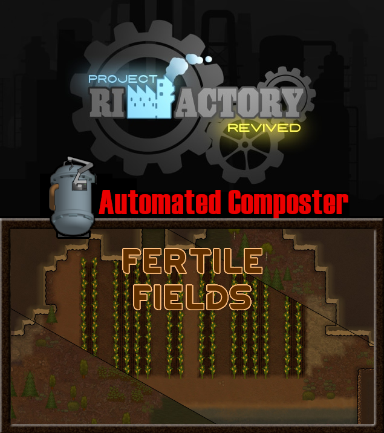

# RimWorld: Feritle Fields + Project RimFactory Automated Composter
Source of my attempt to generate a Project RimFactory automated composter for RimWorld 1.3, 1.4, 1.5, & 1.6

# Inspiration
Inspired by the automated autoclave mod and going from there

# Credit for art
The arm artwork was borrowed from Project RimFactory since this mod is an integration with that. The composter base image is from Feritle Fields' composter.